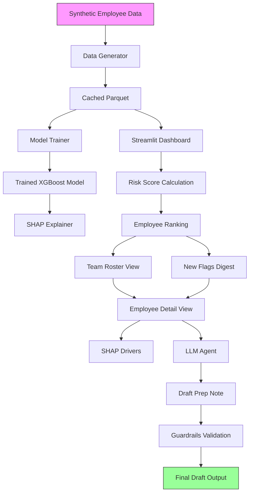

# Attrition Early-Warning Agent

**Honest framing:** This is a demo using synthetic HR data only. No real employee data is used or could be used with this code.

Demo for a Data Scientist (People) application. Predicts 90-day regretted-attrition
risk per employee, explains the drivers, and an LLM agent drafts a manager 1:1 prep
note. Human reviews, never auto-sends. Synthetic data, production-shaped architecture.

## How It Works



## Stack

- Python 3.11
- xgboost
- shap
- pandas
- faker (synthetic data)
- anthropic (agent)
- streamlit (UI)
- pytest

Deploy target: Replit.

## Principles

- Synthetic data only. No real HR data anywhere.
- Every prediction must be explainable (SHAP drivers attached).
- Agent output is a DRAFT for human review. Never an action.
- Small, tested, committed increments. One concern per module.
- Determinism where possible: seed everything (np, random, faker).

## Structure

```
data/        synthetic generator + cached parquet
model/       train, evaluate, explain, persisted artifacts
agent/       prompt builder + LLM call + guardrails
app/         streamlit dashboard
tests/       pytest, one file per module
```

## Done

= code + passing test + committed.

## Setup

1. Install dependencies: `pip install -r requirements.txt`
2. Run tests: `pytest`
3. Launch dashboard: `streamlit run app/dashboard.py`

## Loom Script (5-bullet walkthrough)

- Open the dashboard to see the team roster sorted by attrition risk score with visual risk bands (🔴 High, 🟠 Medium, 🟢 Low)
- Switch to the "This week's new flags" tab to see employees above the risk threshold (default 70%)
- Click on any employee to view their detailed risk score, SHAP drivers showing top risk factors, and a LLM-generated 1:1 prep note draft
- Observe how the prep note follows guidelines: labeled as DRAFT, focuses on development opportunities, and avoids direct attrition risk mentions
- Adjust the risk threshold slider in the sidebar to dynamically filter the new flags digest
