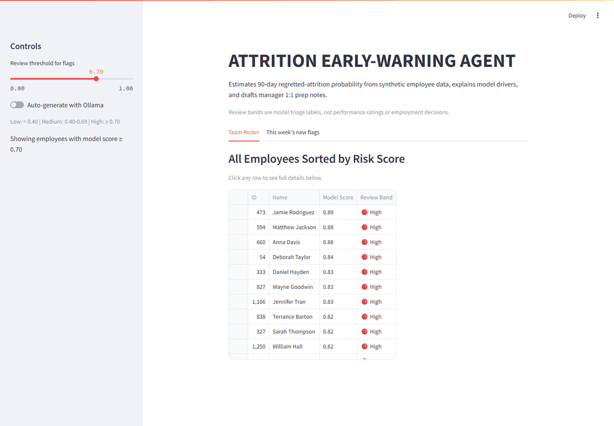
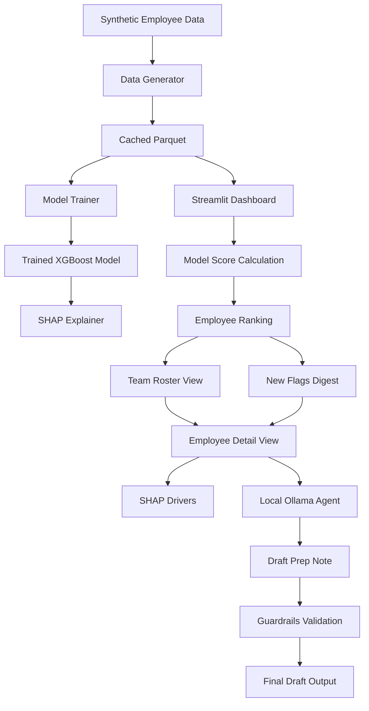

# Attrition Early-Warning Agent

This is a demo using synthetic HR data only. No real employee data is used or supported by this code.

The application estimates 90-day regretted-attrition probability, explains model drivers, and drafts manager 1:1 prep notes. Every note is a draft for human review and is never auto-sent.

## Demo



## How It Works



## Stack

- Python 3.11
- XGBoost
- SHAP
- pandas
- Faker synthetic data
- Ollama local model API
- Streamlit
- FastAPI
- pytest

## Review Bands

The dashboard groups model scores into triage bands:

- Low: `< 0.40`
- Medium: `0.40-0.69`
- High: `>= 0.70`

These are model-review labels, not performance ratings or employment decisions.

## Structure

```text
data/        synthetic generator + cached parquet
model/       train, evaluate, explain, persisted artifacts
agent/       prompt builder + local LLM call + guardrails
app/         Streamlit dashboard
api/         FastAPI inference service
tests/       pytest suite
```

## Setup

1. Create and activate a Python 3.11 virtual environment.
2. Install dependencies:
   ```powershell
   python -m pip install -r requirements.txt
   ```
3. Install Ollama from `https://ollama.ai`.
4. Start Ollama:
   ```powershell
   ollama serve
   ```
5. Pull the default model:
   ```powershell
   ollama pull llama3.2:3b
   ```
6. Run tests:
   ```powershell
   python -m pytest
   ```
7. Launch the dashboard:
   ```powershell
   python -m streamlit run app/dashboard.py
   ```
8. Launch the API:
   ```powershell
   python -m uvicorn api.main:app --host 127.0.0.1 --port 8000
   ```

Optional Ollama settings are documented in `.env.example`.

## API

- `GET /health`
- `GET /metadata`
- `GET /versions`
- `GET /schema`
- `POST /predict`
- `POST /explain`

OpenAPI docs are available at `http://127.0.0.1:8000/docs` when the API is running.

